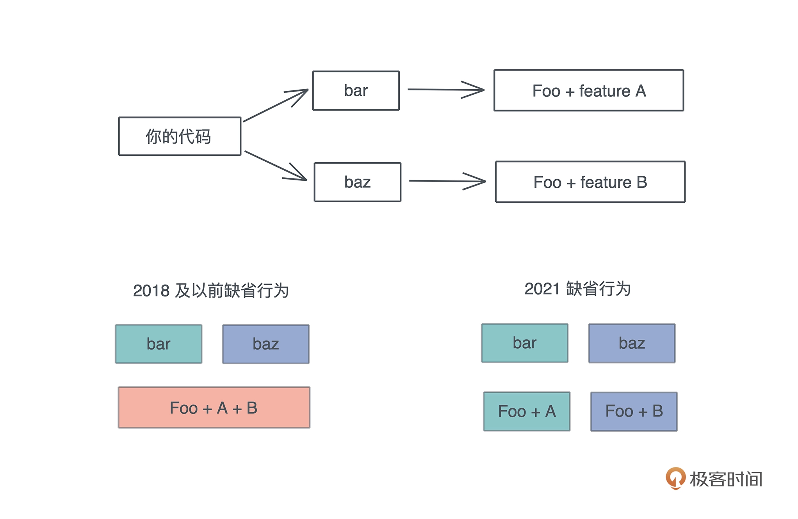


当审判的时候、恶人必站立不住


## 场景

1. 2018 的 async / await / dyn，在 2015 中就没有严格保留成关键字。
2. 假设语言在迭代的过程中发现 actor 需要成为保留字，但如果将其设置为保留字就会破坏兼容性，会让之前把 actor 当成普通名称使用的代码无法编译通过。
3. 依赖的库使用的 rust 版本较低，开发者想使用最新语言特性，库开发者不想升级

## 解决方案

Rust 通过“版次”非常聪明地解决了这个问题。库的作者还是以旧的版次发布他的代码，使用库的开发者可以选择他们想使用最新的版次，二者可以完全不一致，编译时，Rust 编译器以旧的版次的功能编译旧的库，而以新的版次编译使用者的代码。

```toml
[package]
name = "test-rust-edition"
version = "0.1.0"
edition = "2021"

[dependencies]
rbpf = "0.1.0"
futures = "0.3"
```

rfpf 版次是 2015， futures 版次 2018， 我的项目版次 2021，三个版次的 crate 可以协同工作

## 重点

1. 不声明版次就意味着 2015

## Rust2021 版次

### 闭包的不相交捕获

在 2021 之前，哪怕你只用到了其中一个域，闭包也需要捕获整个数据结构，即使是引用。但是 2021 之后，闭包可以只捕获需要的域

```rust
struct Employee {
    name: String,
    title: String,
}

fn main() {
    let tom = Employee {
        name: "Tom".into(),
        title: "Engineer".into(),
    };

    drop(tom.name);

    println!("title: {}", tom.title);

    // 之前这句不能工作，2021 可以编译
    let c = || println!("{}", tom.title);
    c();
}
```

### feature resolver



## 新的 prelude

任何语言都会缺省引入某些命名空间下的一些非常常见的行为，这样让开发者使用起来很方便。Rust 也不例外，它会缺省引入一些 trait 、数据结构和宏，比如我们使用的 From / Into 这样的 trait、Vec 这样的数据结构，以及 println! / vec! 这样的宏。这样在写代码的时候，就不需要频繁地使用 use。

在 2021 版次中，TryInto、TryFrom 和 FromIterator 默认被引入到 prelude 中，我们不再需要使用 use 声明了。比如现在下面的语句就没必要了，因为 prelude 已经包含了：

```rust
use std::convert::TryFrom;
```
