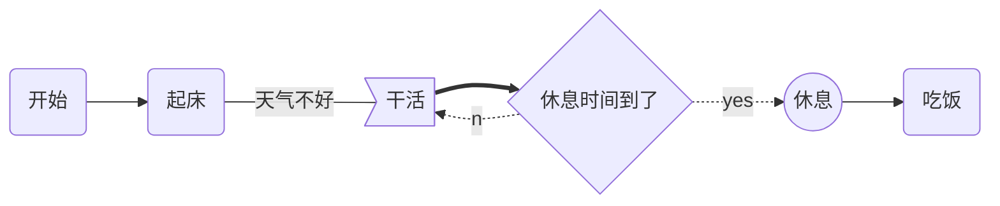
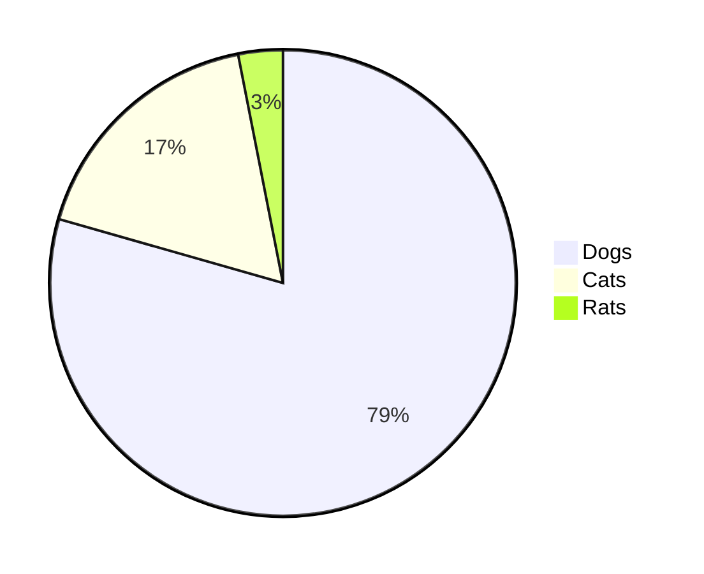
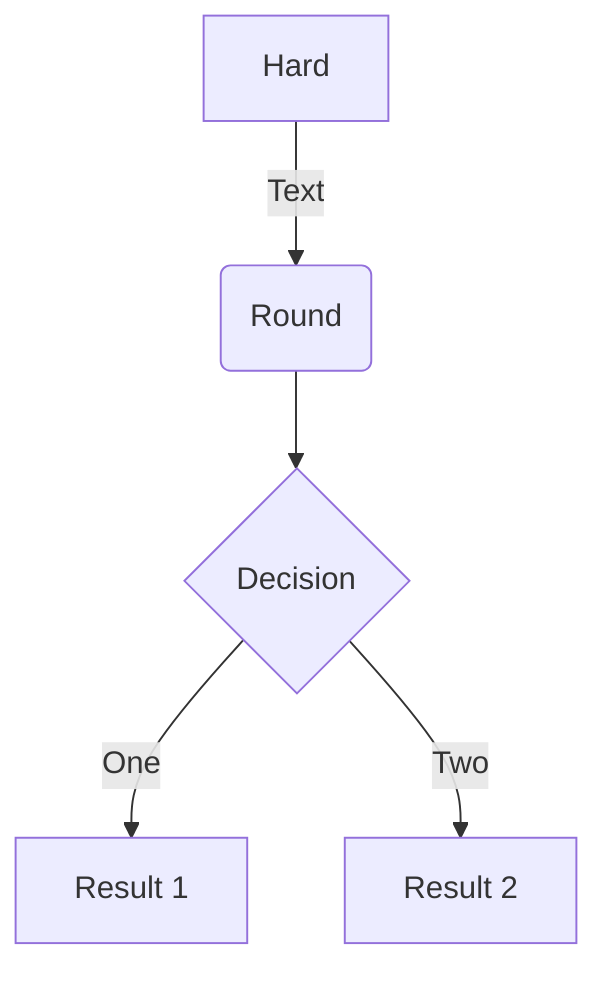

```mermaid
graph LR
    A(开始) -->B(起床)
    B --天气不好--- C>干活]
    C ==> D{休息时间到了}
    D -.yes.-> E((休息))
    D -.no.-> C
    E --> F(吃饭)
```

```mermaid
pie
"Dogs" : 386
"Cats" : 85
"Rats" : 15
```

```mermaid
graph TD
A[Hard] -->|Text| B(Round)
B --> C{Decision}
C -->|One| D[Result 1]
C -->|Two| E[Result 2]
```
